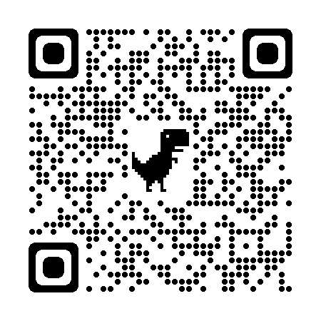

### _Breakout Mayhem_ 

The repository is the first coding project built entirely from the ground-up in the course of my web development formation. The purpose is to rehearse computer science concepts and programming languages. Project specification was to develop a game application.

I did set myself with the additional objective to build a real-time (as opposed to just turn-by-turn) two players game.

### About

_Breakout Mayhem_ is a tribute to two masterpiece classics of computing games ✨**Pong**✨ and ✨**Breakout**✨. Two players battle with a paddle to control their balls and destroy as much bricks as possible and earn points. Bricks can contain surprises and super powers!

### Run

[Click link](https://breakoutmayhem.netlify.app) or scan _QR_ code

### Controllers

| Action | Desktop | Mobile |
|:--------|:-----------:|:------------:|
| Moving **left** paddle | $Q$ and $W$ | _touch_ event |
| Moving **right** paddle | $\uparrow$ and $\downarrow$ | _touch_ event | 
| Abandon a game | Hold _space_ | Triple click score |

### Settings

Most parameters of the game may be changed through a _singleton_ object including ball speed, paddle control, number of lives, brick sizes, etc. Developers can also easily build their own map via a Excel spreadsheet attached in the repository: layout, bricks, walls.

### Languages and concepts

- Javascript (ES6) + HTML5 + CSS3
- DOM manipulation + functions + callbacks + iterators + objects + classes + modules + asynchronous programming + responsive design + external libraries
- Code follows a _React framework_ approach using functional component programming.

Thanks for your attention. Happy gaming!